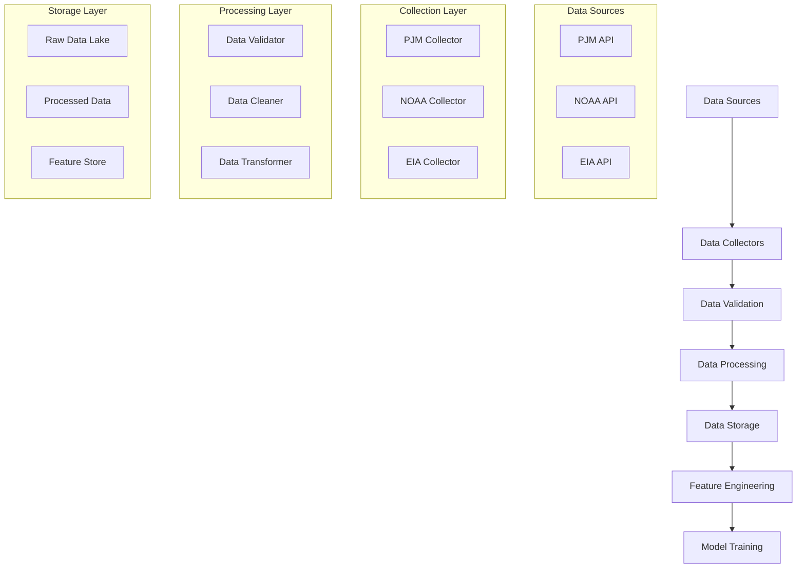

# Data Collection Pipeline Architecture Design

## 📋 Overview

This document outlines the comprehensive data collection pipeline for the thesis project "Daily and Hourly Electricity Price Forecasting Using Machine Learning Approaches". The pipeline is designed to collect, process, and store data from three primary sources: PJM, NOAA, and EIA.

## 🎯 Data Sources and Requirements

### Primary Data Sources

#### 1. PJM Data (2014-2024)
**Essential Data Types:**
- **Real-Time Hourly LMPs** - Primary target variable
- **Day-Ahead Hourly LMPs** - Key feature for forecasting
- **Settlements Verified Hourly LMPs** - Most accurate historical data
- **Instantaneous Load** - Real-time electricity demand
- **Load Forecast** - Seven-day load forecasts
- **Historical Load Forecasts** - Model training data
- **Generation by Fuel Type** - Fuel mix information

#### 2. NOAA Weather Data
**Required Variables:**
- Temperature (ambient, dew point)
- Humidity
- Wind speed and direction
- Precipitation
- Weather conditions
- Atmospheric pressure

#### 3. EIA Data
**Required Data:**
- Fuel prices (natural gas, coal, oil)
- Renewable energy generation
- Energy consumption statistics
- Market indicators

## 🏗️ Pipeline Architecture

### High-Level Architecture



### Detailed Pipeline Components

#### 1. Data Collection Layer

**PJM Data Collector**
- Real-time API integration
- Historical data bulk download
- Automated retry mechanisms
- Rate limiting compliance
- Data format standardization

**NOAA Weather Collector**
- Station-based data collection
- Geographic coverage mapping
- Temporal aggregation (hourly/daily)
- Missing data interpolation
- Quality control checks

**EIA Data Collector**
- API key management
- Scheduled data updates
- Data format normalization
- Time zone handling
- Unit conversion

#### 2. Data Validation Layer

**Quality Checks**
- Data completeness validation
- Outlier detection
- Temporal consistency checks
- Cross-source validation
- Data type verification

**Error Handling**
- Missing data strategies
- Anomaly detection
- Data recovery mechanisms
- Logging and alerting
- Fallback procedures

#### 3. Data Processing Layer

**Data Cleaning**
- Duplicate removal
- Missing value imputation
- Outlier treatment
- Time series alignment
- Time zone standardization

**Data Transformation**
- Feature engineering
- Temporal aggregation
- Spatial aggregation
- Normalization/scaling
- Format standardization

#### 4. Data Storage Layer

**Raw Data Storage**
- Time-series database
- Partitioned by date/source
- Immutable storage
- Backup and recovery
- Data versioning

**Processed Data Storage**
- Feature store
- Model-ready datasets
- Training/validation splits
- Metadata management
- Access control

## 📁 Directory Structure for Data Pipeline

```
02_data/
├── raw/
│   ├── pjm/
│   │   ├── lmp_realtime_hourly/
│   │   ├── lmp_dayahead_hourly/
│   │   ├── lmp_settlements_hourly/
│   │   ├── load_instantaneous/
│   │   ├── load_forecast/
│   │   └── generation_fuel_type/
│   ├── noaa/
│   │   ├── weather_stations/
│   │   └── meteorological_data/
│   └── eia/
│       ├── fuel_prices/
│       └── renewable_generation/
├── processed/
│   ├── cleaned/
│   ├── validated/
│   └── transformed/
├── features/
│   ├── engineered_features/
│   ├── temporal_features/
│   └── spatial_features/
└── metadata/
    ├── data_schema/
    ├── quality_reports/
    └── collection_logs/
```

## 🔧 Implementation Components

### Core Modules

#### 1. Data Collectors (`03_code/data_collection/collectors/`)
- `pjm_collector.py` - PJM data collection
- `noaa_collector.py` - NOAA weather data
- `eia_collector.py` - EIA energy data

#### 2. Data Processors (`03_code/data_collection/processors/`)
- `data_validator.py` - Quality validation
- `data_cleaner.py` - Data cleaning
- `data_transformer.py` - Data transformation

#### 3. Storage Managers (`03_code/data_collection/storage/`)
- `raw_storage.py` - Raw data management
- `processed_storage.py` - Processed data
- `feature_store.py` - Feature storage

#### 4. Utilities (`03_code/data_collection/utils/`)
- `config_manager.py` - Configuration management
- `logger.py` - Logging utilities
- `scheduler.py` - Task scheduling

### Configuration Files

#### Data Collection Configuration (`06_deployment/config/data_collection_config.yaml`)
```yaml
data_sources:
  pjm:
    base_url: "https://api.pjm.com/api/v1/"
    data_types:
      - real_time_hourly_lmp
      - day_ahead_hourly_lmp
      - settlements_hourly_lmp
      - instantaneous_load
      - load_forecast
      - generation_fuel_type
    date_range:
      start: "2014-01-01"
      end: "2024-12-31"
    update_frequency: "hourly"
    
  noaa:
    base_url: "https://www.ncdc.noaa.gov/cdo-web/api/v2/"
    stations:
      - "station_id_list"
    variables:
      - "temperature"
      - "humidity"
      - "wind_speed"
      - "precipitation"
    date_range:
      start: "2014-01-01"
      end: "2024-12-31"
    update_frequency: "daily"
    
  eia:
    base_url: "https://api.eia.gov/v2/"
    api_key: "your_api_key"
    data_categories:
      - "fuel_prices"
      - "renewable_generation"
    date_range:
      start: "2014-01-01"
      end: "2024-12-31"
    update_frequency: "daily"

storage:
  raw_data_path: "02_data/raw/"
  processed_data_path: "02_data/processed/"
  features_path: "02_data/features/"
  backup_enabled: true
  compression: "gzip"

quality_control:
  completeness_threshold: 0.95
  outlier_detection_method: "iqr"
  validation_rules_file: "03_code/data_collection/config/validation_rules.yaml"
```

## 🚀 Execution Workflow

### 1. Initial Data Collection
```python
# Pseudocode for initial bulk collection
def initial_data_collection():
    for source in [PJM, NOAA, EIA]:
        collector = get_collector(source)
        for data_type in source.data_types:
            raw_data = collector.bulk_download(data_type, date_range)
            validator.validate(raw_data)
            storage.store_raw(raw_data)
```

### 2. Incremental Updates
```python
# Pseudocode for incremental updates
def incremental_updates():
    for source in [PJM, NOAA, EIA]:
        collector = get_collector(source)
        latest_data = collector.get_latest_updates()
        if validator.validate(latest_data):
            storage.append_raw(latest_data)
            processor.update_features(latest_data)
```

### 3. Data Processing Pipeline
```python
# Pseudocode for data processing
def process_raw_data():
    raw_data = storage.get_raw_data()
    cleaned_data = cleaner.clean(raw_data)
    transformed_data = transformer.transform(cleaned_data)
    features = engineer_features(transformed_data)
    storage.store_processed(features)
```

## 📊 Data Quality Metrics

### Quality Indicators
- **Completeness**: Percentage of non-missing values
- **Accuracy**: Deviation from expected ranges
- **Consistency**: Temporal and spatial consistency
- **Timeliness**: Data freshness and update frequency
- **Validity**: Conformance to data schema

### Monitoring and Alerting
- Real-time quality dashboards
- Automated alerts for quality degradation
- Daily quality reports
- Trend analysis of data quality

## 🔒 Security and Compliance

### Data Security
- API key encryption
- Secure data transmission
- Access control mechanisms
- Audit logging
- Data encryption at rest

### Compliance
- Data usage agreements
- Privacy regulations
- Attribution requirements
- Data retention policies

## 📈 Performance Considerations

### Optimization Strategies
- Parallel data collection
- Efficient data storage formats
- Indexing for fast queries
- Caching mechanisms
- Resource monitoring

### Scalability
- Horizontal scaling capabilities
- Load balancing
- Distributed processing
- Cloud storage integration

## 🔄 Maintenance and Operations

### Regular Tasks
- Daily data collection monitoring
- Weekly quality reports
- Monthly performance reviews
- Quarterly system updates
- Annual data archiving

### Troubleshooting
- Common error scenarios
- Recovery procedures
- Debugging tools
- Contact procedures

## 📝 Next Steps

1. **Implement PJM Data Collector** - Start with the most critical data source
2. **Develop Data Validation Framework** - Ensure data quality from the start
3. **Create Storage Infrastructure** - Set up efficient data storage
4. **Build Processing Pipeline** - Transform raw data into model-ready features
5. **Establish Monitoring** - Track data quality and system performance

This architecture provides a robust foundation for collecting and managing the diverse data sources required for your electricity price forecasting thesis.